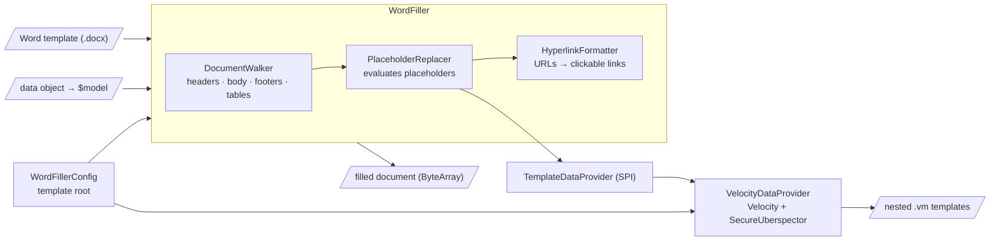

# Word Filler

A Kotlin library for filling Microsoft Word (`.docx`) document templates with dynamic data using Apache Velocity
template expressions.

## Features

- Fill Word document templates with dynamic data via `{...}` placeholders
- Full Apache Velocity syntax inside placeholders (properties, conditionals, loops, method calls)
- Nested `.vm` sub-templates for complex document fragments
- Handles placeholders that Word splits across multiple runs
- Processes paragraphs, tables (including nested content), headers, and footers
- Automatic detection of `http(s)://` URLs and conversion into styled, clickable hyperlinks
- Multi-line values rendered as proper line breaks
- Load Word templates from the classpath, a `File`, or any `InputStream`

## How It Works



`WordFiller` walks the document (headers, body, footers, tables - via `DocumentWalker`),
replaces `{...}` placeholders with values evaluated by the pluggable
`TemplateDataProvider` (Velocity by default), converts plain-text URLs into hyperlinks,
and returns the filled document as a byte array. `WordFillerConfig` is the shared
source of truth for where templates are loaded from.

## Installation

### Gradle (Kotlin DSL)

```kotlin
dependencies {
    implementation("com.lubomirdruga:word-filler:1.0.0")
}
```

### Maven

```xml

<dependency>
    <groupId>com.lubomirdruga</groupId>
    <artifactId>word-filler</artifactId>
    <version>1.0.0</version>
</dependency>
```

## Usage

### Basic Usage - Classpath Template

```kotlin
import com.lubomirdruga.wordfiller.WordFiller
import com.lubomirdruga.wordfiller.WordFillerConfig
import com.lubomirdruga.wordfiller.provider.VelocityDataProvider
import java.io.File

data class Person(
    val name: String,
    val jobTitle: String,
)

fun main() {
    val config = WordFillerConfig() // templates under /word-filler/ on the classpath
    val filler = WordFiller(config, VelocityDataProvider(config))

    val person = Person("John Doe", "Software Engineer")

    // Loads the Word template from the classpath at /word-filler/my-template.docx
    val output: ByteArray = filler.export("my-template", person)

    File("output.docx").writeBytes(output)
}
```

### Custom Template Location

`WordFillerConfig` is the single source of truth for where templates live. Pass a custom
base path to load templates from a different classpath root:

```kotlin
val config = WordFillerConfig(templateBasePath = "my/templates")
val filler = WordFiller(config, VelocityDataProvider(config))

// Word template:      /my/templates/invoice.docx
// Nested .vm template: /my/templates/invoice/address.vm
val output = filler.export("invoice", data)
```

### Filesystem or Stream Templates

```kotlin
val config = WordFillerConfig()
val filler = WordFiller(config, VelocityDataProvider(config))

// From a file; "my-template" is still used to locate nested .vm templates
val output = filler.exportFromFile(File("/path/to/template.docx"), "my-template", data)

// From any InputStream
val output2 = filler.exportFromStream(inputStream, "my-template", data)
```

The data object can be any Kotlin/Java object (its public getters are accessible in
templates as `$model.property`) or a `Map<String, Any?>`.

## Template Structure

### Word Document Placeholders

In the Word document, wrap Velocity expressions in curly braces `{}`:

```text
Hello {$model.name}!

Your job title is: {$model.jobTitle}
```

The bound data object is always available as `$model`. Placeholders work in body
paragraphs, table cells, headers, and footers, and are found even when Word internally
splits the placeholder text across multiple runs.

### Nested Velocity Templates

For complex fragments, reference a `.vm` file with the `{|name|}` syntax. Sub-templates
are resolved on the classpath using the pattern `/<templateBasePath>/<templateName>/<name>.vm`
(so `/word-filler/<templateName>/<name>.vm` with the default config), where
`<templateName>` is the name passed to `export` / `exportFromFile` / `exportFromStream`.

**Example directory structure:**

```text
src/main/resources/
  └── word-filler/
      ├── my-template.docx
      └── my-template/
          ├── person_info.vm
          └── address.vm
```

**Word document integration:**

```text
Person: {|person_info|}
Address: {|address|}
```

**person_info.vm example:**

```velocity
#if($model.name)$model.name - $model.jobTitle#{else}No person information available#end
```

If a referenced sub-template cannot be found, the export fails with a
`WordFillerException` naming the missing `.vm` path - see [Error Handling](#error-handling).

### Velocity Syntax

Any Velocity syntax works inside placeholders and `.vm` files:

```velocity
## Simple variable
$model.propertyName

## Conditional
#if($model.value)Value exists: $model.value#{else}No value#end

## Loop
#foreach($item in $model.items)- $item.name
#end

## Method calls
$model.getValue()
$model.name.toUpperCase()
```

### Escaping Literal Braces

Braces normally delimit placeholders. To put literal braces (or a backslash) in the
document text, escape them:

| Sequence | Output |
|----------|--------|
| `\{`     | `{`    |
| `\}`     | `}`    |
| `\\`     | `\`    |

Escapes work inside and outside placeholders, and even when Word splits the escape
sequence across runs.

### Hyperlinks

After substitution, any plain-text `http://` or `https://` URL in the document is
automatically converted into a real clickable hyperlink (blue, underlined), keeping
the surrounding text and its formatting intact. Sentence punctuation directly after
a URL (`.,;:!?"')]}`) is kept as plain text, not made part of the link.

### Multi-line Values

If an evaluated expression produces multiple lines, they are rendered as line breaks
within the paragraph.

## Template Security

Templates are code: a Velocity expression can call methods on the data object you
bind as `$model`. By default the engine runs with Velocity's `SecureUberspector`,
which blocks reflection escapes such as `$model.class.classLoader` or anything on
`ClassLoader`, `Runtime`, `System`, `Thread`, etc. Normal property access and method
calls (`$model.name.toUpperCase()`) work unchanged; blocked references stay
unresolved and render literally.

If your templates are fully trusted and genuinely need unrestricted introspection,
opt out explicitly:

```kotlin
VelocityDataProvider(config, secureIntrospection = false)
```

Even in secure mode, only let people you trust author templates - expressions can
still call any public method on the model you hand them.

## Error Handling

The library fails fast - errors throw instead of silently producing a wrong document:

- `WordFillerException` (unchecked) - template/content problems: Word template not
  found (classpath or file), nested `.vm` template missing, Velocity parse/evaluation
  failure, or an unterminated placeholder (`{` never closed within its paragraph).
  Messages include the template name and offending expression or path.
- `IllegalArgumentException` - wiring mistakes, e.g. constructing `WordFiller` with a
  provider that was created with a different `WordFillerConfig`.

## Thread Safety

A single `WordFiller` + `VelocityDataProvider` pair can be shared across threads and
used for concurrent exports: the substitution state is created per export, the
hyperlink formatter is stateless, and `VelocityEngine` is thread-safe after
initialization with a fresh `VelocityContext` per evaluation.

## Logging

The library logs through SLF4J at debug level only (template resolution, hyperlink
conversion). Add an SLF4J provider (Logback, Log4j2, `slf4j-simple`, …) to see the
output; without one, SLF4J prints its no-operation notice and stays silent.

## API Reference

### WordFiller

```kotlin
WordFiller(config: WordFillerConfig, dataProvider: TemplateDataProvider)
```

Methods (all return `ByteArray` containing the produced `.docx`):

- `export(template: String, obj: Any?)` - loads the Word template from the classpath at
  `/<config.templateBasePath>/<template>.docx`
- `exportFromFile(templateFile: File, templateName: String, obj: Any?)` - loads the Word template from the filesystem
- `exportFromStream(inputStream: InputStream, templateName: String, obj: Any?)` - loads the Word template from a stream

### WordFillerConfig

```kotlin
WordFillerConfig(templateBasePath: String = "word-filler")
```

The single source of truth for the template root. It knows nothing about any
particular template engine:

- `wordTemplatePath(template)` → `/<templateBasePath>/<template>.docx` (used by `export()`)
- `resolve(relativePath)` → `/<templateBasePath>/<relativePath>` - generic helper for
  `TemplateDataProvider` implementations to locate their own resources under the shared root

Leading/trailing slashes are normalized.

### VelocityDataProvider

```kotlin
VelocityDataProvider(config: WordFillerConfig, secureIntrospection: Boolean = true)
```

Evaluates placeholder expressions with Apache Velocity, with secure introspection
enabled by default (see [Template Security](#template-security)). The `.vm` location pattern
(`/<templateBasePath>/<template>/<name>.vm`) is owned by this provider - it derives it
from the shared config's root via `resolve()`. The config is a required parameter, and `WordFiller`
rejects (at construction, with `IllegalArgumentException`) a provider whose config
does not match its own - so Word templates and nested `.vm` templates always resolve
under the same root.

### TemplateDataProvider

```kotlin
fun interface TemplateDataProvider {
    val config: WordFillerConfig?
        get() = null

    fun evaluateExpression(expression: String, template: String, value: Any?): String
}
```

Implement this (or just pass a lambda) to plug in a different expression engine than
Velocity - each provider owns its own resource layout. Providers that resolve templates
by path should override `config`, use `config.resolve(...)` to anchor their resources
under the shared root, so `WordFiller` can verify both use the same root; lambda
providers leave `config` as `null` and skip the check.

## Limitations

- A placeholder must start and end within the same paragraph - a `{` left unclosed at
  the end of a paragraph fails the export with a `WordFillerException`.

## Building the Library

```bash
./gradlew build           # build + run tests and ktlint; JAR lands in build/libs/
./gradlew test            # run the test suite
./gradlew ktlintCheck     # code style check (ktlint, ktlint_official rules)
./gradlew ktlintFormat    # auto-fix code style violations
./gradlew detekt          # static analysis (rules ktlint cannot express, see detekt.yml)
./gradlew publishToMavenLocal
./gradlew publish         # publishes to build/repo by default; see build.gradle.kts
```

The library version is read from the `VERSION` file at the repository root - edit that
file to cut a new version.

## Requirements

- JVM 17 or higher

## Dependencies

- Apache POI 5.5.1 (Word document processing)
- Apache Velocity 2.4.1 (template engine)
- SLF4J API 2.0.18 (logging facade; bring your own provider)

## License

This project is licensed under the Apache License 2.0.

## Contributing

Contributions are welcome. Please feel free to submit a Pull Request or open an issue for discussion.
